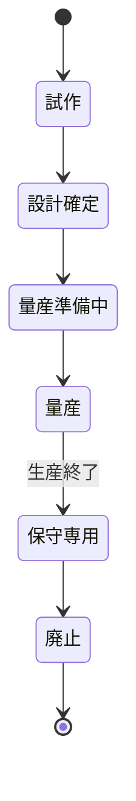
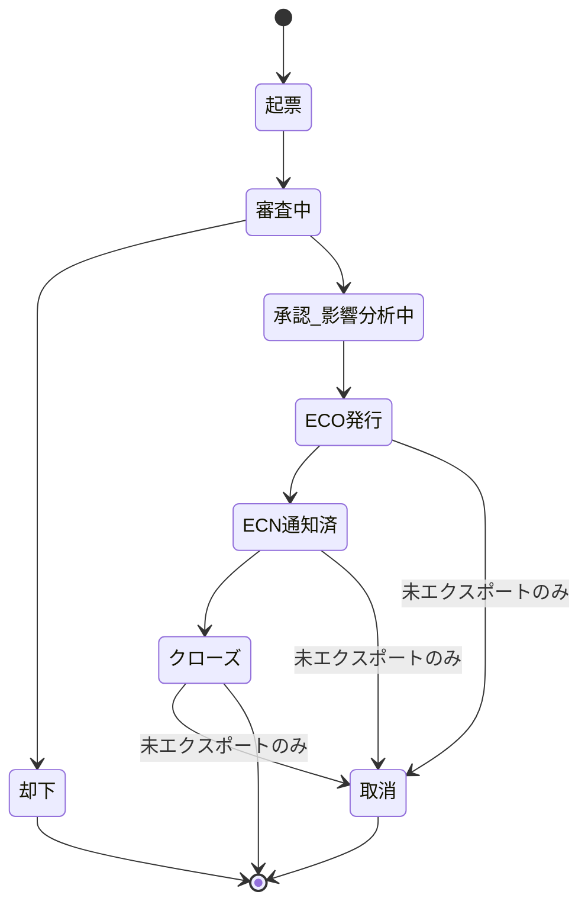
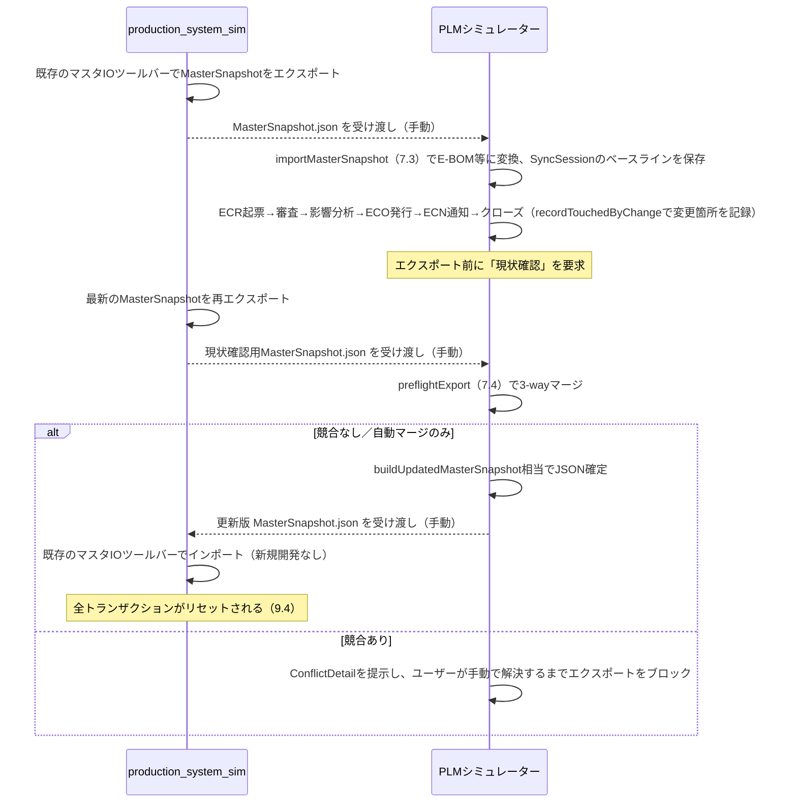

# PLMシミュレーター システム化要件書（Rev.H — Claude Code実装インプット）

## 0. 前提・位置づけ

本書は `PLM_domain_knowledge.md`（PLMドメイン知識体系）を業務知識のインプットとし、既存の生産管理トレーニングシミュレーター（`github.com/yoheitaniguchi/production_system_sim`）と同じ開発アプローチで、**PLM領域の学習・検証用シミュレーター**を新規開発するための要件書である。

### Rev.Cでの主な訂正（Claude Codeによる実ソース調査に基づく）

Rev.Bまでは過去の設計会話の記憶を根拠にしていたが、実際に`production_system_sim`のソースを調査した結果、**複数の重要な誤りが判明した**。

| 項目 | Rev.Bまでの想定 | 実際（Rev.C） |
|---|---|---|
| 教材製品 | コンベア装置 | **木製イス**（既定プリセット）／自転車（第2プリセット）。コンベア装置は別リポジトリ`mini-simulator`の題材で無関係だった |
| ドメイン構成 | 単一`logic.ts`に集約 | **ドメインごとに20ファイルへ分割**（Rev.Aの想定が正しかった） |
| 外部データ連携 | インポート機構は存在せず新規開発が必要 | **`masterIO.ts`にJSON入出力機構が既に存在**。新規開発は不要 |
| 時間の扱い | ISO日付文字列 | **整数の日数オフセット（D+N、`day: number`）** |
| 品目コード | 意味なしコードを想定 | 強制はされないが**慣習的にFG-/SA-/RM-/PT-のプレフィックス**を使用。作成後は不変 |
| マスタ編集 | 未確認 | UIからフルCRUD可能。ただし品目コード等の改名は不可、循環BOMは登録時に拒否 |

以下、2〜12章をこの訂正を反映して全面改訂した（Rev.C）。

### Rev.Dでの追加訂正（masterIO.ts本体の実ソース調査に基づく）

Rev.Cの`MasterSnapshot`型は構成要素（`ItemMaster`/`BomLine`等）から推定したものだったが、`masterIO.ts`自体を読んだ結果、**BOM行の配列名が`bomLines`ではなく`bom`だった**ことが判明した。5章・7.3の型・関数をこれに合わせて修正し、あわせて次の実装上の要点も反映した。

- 検証は二層構造：フィールド単位のスキーマ検証は最初のエラーで即時中断、業務整合性検証（主キー重複・BOM循環・参照整合性）は全項目をまとめてから一括拒否
- `defaultSupplierId`は型としては任意だが、BUY品目で未設定だと業務検証でエラーになるため実質必須
- インポート時にリセットされる対象は受注・計画オーダ・製造・購買・在庫・出荷の全トランザクションテーブルで、確認ダイアログは進行中のトランザクションがある場合のみ表示される

### Rev.Eでのヒアリング結果（業務要件面5件）

12.3の5件について洋平さんにヒアリングした結果、以下の通り確定した。

| 項目 | 結論 |
|---|---|
| バリアント／コンフィギュレーションBOM | **対応する**。貴社の実際の製品はバリアント品が多いとのことなので、4.4・5章・7.2に「150%BOM（オプショングループ）」パターンを追加した |
| 拠点別M-BOM | 対応しない（production_system_simが単一拠点前提のため） |
| CCB（変更審査会）の意思決定ルール | 現状のシンプルなモデルのまま（設計リーダー＋重大変更時は合議）。変更なし |
| サプライヤ影響のスコープ | スコープ外のまま（11章）。変更なし |
| 現場フィードバックループ | **追加する**。UC-ECM-5として、下流（製造）からのECR起票シナリオを追加した |

### Rev.Fでの追加：SSOT競合検知（コンサルタントレビュー指摘#2への対応）

Rev.Eまでの9章は「PLM側が常に最新をエクスポートする」という前提だったが、production_system_sim側もマスタをフルCRUD編集できるため、**PLM側がECOを起票している間に、誰かがproduction_system_sim側で同じマスタを直接編集している可能性**を無視できないという指摘があった。これに対応するため、エクスポート直前に「現状確認」としてproduction_system_simの最新スナップショットを再取得し、インポート時点（ベースライン）・PLM側の変更・production_system_sim側の最新、の3点を比較する簡易3-wayマージを導入した（7.4・9.6）。PLM側が触っていない箇所はproduction_system_sim側の最新を自動採用し、**両方が同じ箇所を変更していた場合のみ**人間の判断を求める。

### Rev.Gでの追加：コンサルタントレビュー残り5件への対応

| 指摘 | 対応 |
|---|---|
| #1 スコープの誠実な明記 | 1.1・9.5に「本シミュレーターはPDM＋ECM相当で、完全なPLMスコープではない」と明記 |
| #3 承認の集計ルール未規定 | 「必須ロール全員の承認」＋「1人でも却下したら即座に却下」という合議モデルに確定（6.2・7.5） |
| #4 代替部品（承認部品リスト）の欠如 | 4.4のオプショングループと同じ「選択グループ」パターンを流用し、代替部品グループとして追加（4.5・7.6） |
| #5 影響分析がBOM次元止まりである理由の未説明 | 「在庫影響は疎結合連携では原理的に不可能」「サプライヤ・原価影響はデータはあるが意図的にスコープ外にした」という区別を明記（7.1） |
| #6 低コスト改善（原価影響・変更理由の統制語彙） | 原価影響の簡易算出関数を追加（7.7）。`reason`を統制語彙の型に変更（5章） |

あわせて、#2で保留していた`disposition`の「使い切り」が実質機能しない矛盾も、警告として明示する形で解消した（7.5）。

### Rev.Hでの追加：残課題（12.2・12.3）への対応

| 項目 | 対応 |
|---|---|
| 品目コードの新規採番主体（12.2） | **PLM側が発番する**。新規品目はまずPLM側のECOプロセスで生まれるため自然にPLM側が採番者になる。生成規則（4.3）と、production_system_sim側との偶発的な衝突は9.6のSSOT競合検知がそのまま検出することを明記 |
| 異常系ユースケースの拡充（12.3） | `ChangeStatus`に「取消」を追加。未エクスポートのECOのみ取消可能で、エクスポート済みは新しいECRとして差し戻す運用に確定（6.2・7.5・UC-ECM-8/9） |
| オンボーディングのシナリオ台本（12.3） | 10.2に5ステップの具体的な台本を追加 |
| 7.4のBOM行・passthrough側3-wayマージ（12.3） | 品目と同じパターンで完全実装（7.4） |

---

## 1. 目的・スコープ

### 1.1 目的
- PLMの中核概念（品目ライフサイクル、E-BOM／M-BOM、ECR→ECO→ECNの変更管理、PLM⇄生産管理システムの連携）を、実際に操作しながら学べる教材とする。
- 生産管理トレーニングシミュレーターと**対称的な設計**にすることで、「PLMで起きた変更が生産管理側にどう波及するか」を横断的に体験できるようにする（詳細は9章）。
- production_system_simが意図的に実装しなかった概念（BOMのバージョニング・有効日・E-BOM/M-BOMの系統分離）を、PLMシミュレーターが補う関係にする（9.5参照）。

**スコープに関する重要な注記（Rev.G）**：`PLM_domain_knowledge.md`1.2節が示すPLM/PDMの定義に照らすと、本シミュレーターが扱う範囲（品目・BOM・図面のエンジニアリングチェーン管理と変更管理）は、厳密には**PDM＋ECM（変更管理）に相当**する。原価企画・品質記録・サプライヤ管理まで含めた企画〜保守の全ライフサイクルという、本来のPLMのスコープ全体はカバーしていない。本シミュレーターは「PLMの中核であるエンジニアリングチェーン管理」を教える教材であり、PLMの全機能を網羅する教材ではないことを、学習者に明示する（9.5でも再掲）。

### 1.2 スコープ内
- 品目マスタ、E-BOM／M-BOM、ECR／ECO／ECN、文書・版数
- バリアント／コンフィギュレーションBOM（150%BOMパターンによるオプション管理、4.4参照）
- 代替部品（承認部品リスト）（4.5参照）
- 原価影響の簡易算出（購入部品費用の積み上げ差分のみ、7.7参照）
- production_system_simの`masterIO.ts`と互換なJSON（MasterSnapshot）の入出力によるマスタ連携
- BOM逆展開による影響分析

### 1.3 スコープ外（初期リリース）
- 実CADデータ・3Dモデルとの連携
- 本格的な認証・権限基盤
- 大量データでの性能検証
- 本格的な原価計算・原価企画（標準原価の積み上げ体系、原価改善目標管理等。7.7の簡易算出のみスコープ内）
- サプライヤ側の詳細プロセス（発注・受入検査等。ただしサプライヤ影響がスコープ外なのは意図的な選択であり、在庫影響とは性質が異なる点に注意、7.1参照）
- production_system_simの工順（Routing）・作業区（WorkCenter）そのものの編集（連携時はパススルーのみ、5.3参照）

---

## 2. アーキテクチャ方針

`production_system_sim`の実装（Claude Code調査で確認済み）との一貫性を保つ。

| 項目 | 方針 |
|---|---|
| フロントエンド | React + TypeScript + Vite |
| 状態管理 | `useReducer`。`reducer.ts`が`structuredClone`した状態を各ドメインモジュールに渡し、モジュール側が直接書き換える（呼び出し側からは純粋関数として扱える） |
| 永続化 | **なし**（DBなし、localStorageも不使用）。production_system_simと同じく単一セッション・リロードで状態が消える設計を踏襲する |
| ドメイン構成 | **ドメインごとにファイルを分割**（production_system_simの20ファイル構成が前例として確認できたため、Rev.Aの方針を正式に踏襲） |
| テスト | vitest（ドメインロジック単体） + Playwright/axe-core（E2E・アクセシビリティ）の2層構成（production_system_simの実績を踏襲、10.4） |
| 開発プロセス | Claude Codeによるループ①②③（テストループ、`logic-reviewer`/`ux-reviewer`/`issue-spec-reviewer`のレビューsubagent）を用いたAI駆動開発 |

ディレクトリ構成：
```
src/
  domain/
    item.ts             # 品目ライフサイクル
    ebom.ts              # E-BOM構造・版数
    mbom.ts              # M-BOM構造・E→M変換
    changeManagement.ts  # ECR/ECO/ECN状態遷移
    document.ts          # 文書・版数
    masterSnapshot.ts    # MasterSnapshotの取り込み・書き出し（9章）
    impactAnalysis.ts    # BOM逆展開・影響分析（MAX_BOM_DEPTHガード含む）
    reducer.ts           # 全ドメインを束ねるreducer
  domain/__tests__/      # vitest
  e2e/                   # Playwright + axe-core
  ui/                    # 画面（10章）
```

---

## 3. ドメイン分解（7ドメイン）

| # | ドメイン | 扱う中心エンティティ | 対応する知識体系の章 |
|---|---|---|---|
| 1 | 品目（Item） | 品目マスタ、ライフサイクルステータス | 3.2 |
| 2 | E-BOM | 設計部品表、版数、バリアント（オプショングループ） | 2.3, 3.3 |
| 3 | M-BOM | 製造部品表、E→M変換、代替部品（承認部品リスト） | 2.3, 3.3 |
| 4 | 変更管理（ECM） | ECR／ECO／ECN、影響分析 | 2.2 |
| 5 | 文書・版数 | 図面・仕様書 | 1.3 |
| 6 | マスタ連携（Sync） | MasterSnapshotの取り込み・書き出し | 4, 5 |
| 7 | 影響分析（Impact） | BOM逆展開、変更影響トレーサビリティ | 2.2, 5.3 |

---

## 4. 教材用サンプル製品（Teaching Example）— 訂正版

**訂正**：コンベア装置ではなく、`production_system_sim`の既定プリセット**木製イス**を教材とする。これにより、PLM側で作った品目・BOMがそのまま生産管理シミュレーターへ橋渡しできる（9章）。

### 4.1 木製イス（基礎シナリオ）

production_system_simの実データをそのまま引用する。

```
木製イス [FG-100] MAKE・LT2日・売価6,000円
├─ 座面ASSY [SA-200] MAKE・LT1日 ×1
│    └─ 木板 [RM-300] BUY・LT5日・単価800円 ×1
├─ 脚 [PT-400] BUY・LT3日・単価250円 ×4
└─ ネジ [PT-500] BUY・LT3日・単価20円 ×8
```

工順：座面ASSY＝切断(WC-CUT, 18分)、木製イス＝組立(WC-ASM, 30分)→検査(WC-INS, 12分)。

**PLM側のE-BOMは、この構成に「脚部ユニット」という設計上の機能グルーピングを追加**して定義する。

```
木製イス [FG-100]
├─ 座面ASSY [SA-200] ×1
│    └─ 木板 [RM-300] ×1
├─ 脚部ユニット [EBOM-ONLY: EU-450]  ← E-BOMのみに存在する機能グループ
│    ├─ 脚 [PT-400] ×4
│    └─ ネジ [PT-500] ×8
```

M-BOMへの変換時、「脚部ユニット」は組立工程では独立した中間品として扱われないため展開・消滅し、脚とネジは`FG-100`直下へフラットに再配置される（＝production_system_simの実際のBOM構造に一致する）。これは2.3節「E-BOMとM-BOMは構造そのものが本質的に異なる」を、実データで小さく体験させるための意図的な設計であり、7.2の変換ロジックの具体例になる。

### 4.2 自転車（応用シナリオ）

第2プリセット。4階層BOMのため、より複雑な影響分析・変更波及を練習する応用教材として使う。

```
自転車 [FG-700] MAKE・LT2日・売価15,000円
├─ 車輪ASSY [SA-710] MAKE・LT1日 ×2
│    └─ リムASSY [SA-720] MAKE・LT1日 ×1
│         └─ アルミリム材 [RM-730] BUY・LT3日・単価300円 ×1
└─ フレーム [PT-740] BUY・LT3日・単価4,000円 ×1
```

### 4.3 品目コード命名規則（production_system_simの慣習を踏襲）

| プレフィックス | 意味 |
|---|---|
| `FG-` | Finished Goods（完成品） |
| `SA-` | Sub-Assembly（中間製品） |
| `RM-` | Raw Material（原材料） |
| `PT-` | Part（購入部品） |

PLM固有の概念（E-BOMのみに存在する機能グループ等）には、生産管理側と衝突しないよう`EBOM-ONLY:`のような明示的な接頭辞を付け、エクスポート時にM-BOM側で確実に除去されるようにする（7.2）。

**新規品目コードの採番主体（Rev.H、12.2の解決）**：**PLM側が発番する**。新規品目（バリアント解決で生まれる`FG-101`、代替部品の`RM-301`等）は、まずPLM側のECOプロセスを経て生まれるため、生成された時点ではPLM側にしか存在せず、自然にPLM側が採番者になる。命名規則は4.3の表と同じプレフィックス体系を踏襲し、次のように「派生元品目の番号帯の次の空き番号」を割り当てる簡易ルールとする。

```typescript
function generateNewItemCode(
  prefix: 'FG' | 'SA' | 'RM' | 'PT',
  derivedFromItemId: string,       // 派生元の品目（例：FG-100 から FG-101 を作る）
  existingItemIds: Set<string>
): string {
  const baseNum = parseInt(derivedFromItemId.replace(/^[A-Z]+-/, ''), 10);
  let candidate = baseNum + 1;
  while (existingItemIds.has(`${prefix}-${candidate}`)) {
    candidate += 1;
  }
  return `${prefix}-${candidate}`;
}
```

**production_system_sim側と偶然コードが衝突するリスク**：production_system_sim側でも自由にコードを登録できるため（前回調査Q3）、PLM側が発番したコードと同じコードが、production_system_sim側で別の品目として偶然使われる可能性はゼロではない。ただしこれは新しい問題ではなく、**9.6のSSOT競合検知がそのまま検出する**（`baseline`に無かったコードが`ours`にも`theirs`にも別内容で追加されているケースとして、`weTouched && theyChanged`の条件に一致し、`conflict`として提示される）。

### 4.4 バリアント対応シナリオ（応用・Rev.Eで追加）

木製イスの座面材質にバリエーションを持たせ、150%BOM（オプショングループ）パターンを実演する。

```
座面ASSY [SA-200]
└─【オプショングループ：座面の仕上げ】
     ├─ 無垢材 [RM-300] BUY・LT5日・単価800円 ×1　（オプション：無垢材／既存品目）
     └─ クッション材 [RM-301] BUY・LT4日・単価1,200円 ×1　（オプション：布張り／新規品目）
```

「無垢材」を選ぶと従来通り`FG-100`のまま確定する。「布張り」を選ぶと、座面材質が異なる別製品として新しい品目`FG-101`（木製イス〈布張り〉）が確定し、E-BOM／M-BOMもそちらに紐づく。

**設計上の要点**：production_system_sim自体はバリアントという概念を持たない、フラットな品目配列である（前回調査Q2・Q5で確認済み）。そのため、**PLM側で「構成解決（configuration resolution）」を完了させ、1つの具体的な品目・BOMに確定させてからエクスポートする**という役割分担にする。150%BOM（未解決の状態）はPLM内部だけの表現であり、生産管理システム側には常に「解決済みの、ふつうの製品」として渡る（7.2で疑似コード化）。`RM-301`のような新規品目は、ECOのクローズ時にBUY品目として既定仕入先の設定が必須になる（7.3の事前整合性チェックが検出する）。

### 4.5 代替部品（承認部品リスト）シナリオ（応用・Rev.Gで追加）

木製イスの脚（PT-400）に、コストダウンまたはサプライヤ都合で使える承認済みの代替品を用意する。

```
木製イス [FG-100]
└─【代替部品グループ：脚】
     ├─ 脚（標準） [PT-400] BUY・単価250円　優先順位1・承認済
     └─ 脚（代替品B） [PT-401] BUY・単価220円　優先順位2・承認済
```

**4.4のオプショングループとの構造的な共通点・相違点**：どちらも「複数の選択肢から1つを選んでBOM行を確定させる」という点で構造は同じであり、解決ロジック（7.6）も同じパターンを使う。違いは目的にある。**オプショングループは顧客が選ぶ仕様の違い**（座面の仕上げ）で、選ぶと**別の製品**（`FG-101`）になる。**代替部品グループは供給側の都合による同等品の切替**（脚の仕入先変更等）で、選んでも**製品自体は変わらない**（`FG-100`のまま、使う部品だけが変わる）。この違いを教材上も明確に区別する。

**運用ルール**：代替部品として選択できるのは`approvalStatus: '承認済'`の品目のみ。デフォルトは`alternatePriority`が最小（＝優先順位が最も高い）の承認済み品目だが、ユーザーは明示的に別の承認済み代替品へ切り替えられる（例：主要仕入先が欠品した場合の代替品Bへの切替、というシナリオを演じられる）。

---

## 5. データモデル（TypeScript型定義）

production_system_simの`ItemMaster`/`BomLine`と直接互換になるよう、それらを拡張する形で設計する。

```typescript
// ---------- production_system_simと共有する型（そのまま踏襲） ----------
// 出典：production_system_sim/src/types.ts
type MakeBuy = "MAKE" | "BUY";

interface ItemMaster {
  itemId: string;
  name: string;
  makeBuy: MakeBuy;
  leadTimeDays: number;
  defaultSupplierId?: string;
  purchasePrice?: number;
  salesPrice?: number;
}

interface BomLine {
  parentItemId: string;
  childItemId: string;
  qtyPer: number;
}

interface RoutingStep {
  itemId: string;
  stepNo: number;
  workCenter: string;
  stdTimeMin: number;
}

interface WorkCenter {
  workCenter: string;
  ratePerHour: number;
  capacityMinPerDay: number;
}

interface Customer { customerId: string; name: string; }
interface Supplier { supplierId: string; name: string; }

// production_system_sim側のマスタ一式（masterIO.tsが入出力する形。
// 出典：production_system_sim/src/types.ts（masterIO.ts本体調査で確認済み）。
// 全7フィールド必須。BOM行の配列名は「bom」であり「bomLines」ではない点に注意。
interface MasterSnapshot {
  version: 1;
  items: ItemMaster[];
  bom: BomLine[];
  routingSteps: RoutingStep[];
  workCenters: WorkCenter[];
  customers: Customer[];
  suppliers: Supplier[];
}
// parseMasterSnapshot()は各行オブジェクトから既知のフィールドだけを読み、
// それ以外のプロパティ（PLM独自の付加フィールド等）は無視する。ただし
// ItemMaster/BomLine等が要求するフィールドの名前・型・値域が一致しないと
// 即座に拒否される（例：makeBuyは"MAKE"|"BUY"のリテラル以外不可、
// leadTimeDaysは0以上の整数、qtyPerは正の数）。
// また、defaultSupplierIdは型としては任意だが、makeBuy==="BUY"の品目で
// 未設定だと業務整合性検証（assertSnapshotUsable）がエラー判定するため、
// 実質必須になる（5.1「設計判断の要点」参照）。

// ---------- PLM独自の拡張 ----------
type ItemLifecycleStatus =
  | '試作' | '設計確定' | '量産準備中' | '量産' | '保守専用' | '廃止';

// PlmItem = production_system_simのItemMasterに、PLM固有の属性を追加したもの。
// production_system_simへ書き出す際はItemMaster部分のみを取り出す（7.3）。
interface PlmItem extends ItemMaster {
  lifecycleStatus: ItemLifecycleStatus;
  spec?: string;
  drawingRef?: string;          // 文書ドメインへの参照
}

type BomType = 'E' | 'M';

// PlmBomLine = production_system_simのBomLineに、PLM固有の属性を追加したもの。
// M-BOM書き出し時はparentItemId/childItemId/qtyPerのみを取り出す（7.2, 7.3）。
interface PlmBomLine extends BomLine {
  bomLineId: string;
  bomType: BomType;
  version: number;
  effectiveFromDay: number;      // production_system_simに合わせ、D0起点の整数日数
  effectiveToDay?: number;
  processStep?: string;          // M-BOMのみ：工程コード（RoutingStep.stepNoに対応）
  isEbomOnly?: boolean;          // 脚部ユニットのようなE-BOM限定の機能グループ（4.1）
  optionGroupId?: string;        // このBOM行が属するオプショングループ（未設定なら固定行、4.4）
  optionCode?: string;           // optionGroupId設定時のみ有効：このBOM行が表すオプションの識別子
  alternateGroupId?: string;     // このBOM行が属する代替部品グループ（4.5）
  alternatePriority?: number;    // 代替部品グループ内の優先順位（小さいほど優先）
  approvalStatus?: '承認済' | '評価中' | '却下';  // 代替部品として選択可能かどうか（承認済のみ選択可）
}

// バリアント構成の選択結果（4.4）。1つの構成が1つの具体的な品目に対応する。
interface Configuration {
  configId: string;
  baseItemId: string;                 // 元になる品目（例：FG-100）
  selections: Record<string, string>; // optionGroupId -> optionCode
  resolvedItemId: string;             // 構成解決後に確定する品目コード（例：FG-101）
}

// ---------- 変更管理 ----------
type ChangeType = 'ECR' | 'ECO' | 'ECN';

type ChangeStatus =
  | '起票' | '審査中' | '却下' | '承認_影響分析中' | 'ECO発行' | 'ECN通知済' | 'クローズ' | '取消';

type Disposition = '即時廃却' | '使い切り' | '手直し' | '代替品への置き換え';

// 統制語彙（Rev.G）。自由記述だとKPI集計（知識体系6.3節）ができないため型で縛る。
// 自由記述が必要な場合はreasonDetailに書く。
type ChangeReason = 'コスト削減' | '品質・安全' | '顧客要求' | '陳腐化' | '規制対応' | 'その他';

interface ApproverDecision {
  approverRole: '設計リーダー' | '品質保証' | '製造' | '調達';
  decision: '承認' | '却下' | '保留';
  decidedAtDay?: number;
}

interface EngineeringChange {
  changeId: string;
  type: ChangeType;
  status: ChangeStatus;
  reason: ChangeReason;
  reasonDetail?: string;           // 統制語彙で表現しきれない補足（任意の自由記述）
  changeLevel: '軽微' | '重大';
  raisedByRole?: '設計' | '品質保証' | '製造' | '調達';  // 起票元（2.4節の現場フィードバックループ、UC-ECM-5）
  requiredApproverRoles?: ApproverDecision['approverRole'][];  // 重大変更で必須のロール集合（7.5）
  impactedItemIds: string[];
  impactedBomLineIds: string[];
  effectiveFromDay?: number;
  disposition?: Disposition;
  approvals: ApproverDecision[];
}

// ---------- 文書 ----------
interface DesignDocument {
  docId: string;
  version: number;
  relatedItemId: string;
  docType: '図面' | '仕様書';
}

// ---------- SSOT競合検知（Rev.F、9.6） ----------
// PLMシミュレーターがMasterSnapshotをインポートした時点から、エクスポートするまでの
// 「セッション」を表す。インポート時点のスナップショット全体をベースラインとして保持し、
// その後PLM側が実際に変更した品目・BOM行のキーを蓄積する（複数のECOにまたがってよい）。
interface SyncSession {
  importedAtDay: number;
  baseline: MasterSnapshot;
  touchedItemIds: Set<string>;
  touchedBomKeys: Set<string>;  // `${parentItemId}::${childItemId}` 形式
}

interface ConflictDetail {
  kind: 'item' | 'bomLine' | 'passthrough';
  key: string;
  baseline: unknown;
  ours: unknown;    // PLM側で変更した後の値
  theirs: unknown;  // production_system_sim側の現在値（再取得したスナップショットより）
}

interface ExportPreflightResult {
  status: 'clean' | 'autoMerged' | 'conflict';
  mergedSnapshot?: MasterSnapshot;    // status !== 'conflict' の場合のみ
  conflicts?: ConflictDetail[];        // status === 'conflict' の場合のみ
  autoMergedNotes?: string[];          // 参考情報：自動的に取り込んだ相手側の変更点
}
```

**設計判断の要点**：
- 品目コードは production_system_sim と同じく**作成後は不変**とする（改名は削除→再登録のみ）。これはEXT-24の踏襲。
- BOMの循環参照防止は production_system_sim の「三重防御」パターンを踏襲する：①登録時にDFSで拒否、②MasterSnapshotインポート時に全件検査、③実行時は訪問済みSet＋深さ上限（`MAX_BOM_DEPTH = 20`）で例外化（7.1）。
- 編集可否は production_system_sim の「禁止 vs 警告」の線引き（EXT-20：復旧不能な状態を生むものだけ禁止、計算結果が変わるだけのものは警告に留める）を踏襲する。例：クローズ済みECOがあるBOM行の再編集は警告のみで許可。

---

## 6. 状態遷移

### 6.1 品目ライフサイクルステータス



（`production_system_sim`側のItemMasterにはライフサイクル概念が存在しない。この状態はPLM独自の付加価値であり、生産管理側へは同期されない。）

### 6.2 変更管理（ECR→ECO→ECN→取消）



**遷移ルール**：
- `審査中 → 承認_影響分析中` は、`changeLevel: '重大'` なら複数ロール（設計リーダー・品質保証・製造）の承認が必要、`'軽微'` なら設計リーダーの承認のみで遷移可（2.2節）。集計は7.5の`aggregateApprovalStatus`（全員承認必須、1人でも却下すれば即却下）に従う。
- `ECO発行` への遷移は `effectiveFromDay` が設定されていることを不変条件とする。
- `ECN通知済 → クローズ` への遷移時、9章のマスタ連携ドメインで更新済みMasterSnapshotのエクスポートが可能になる。
- **`取消`（Rev.H追加）**：`ECO発行`／`ECN通知済`／`クローズ`のいずれからも、**そのECOに対応する`SyncEvent`がまだエクスポートされていない場合に限り**`取消`へ遷移できる（7.5の`checkWithdrawable`）。エクスポート済み（＝既にproduction_system_sim側に反映されている可能性がある）の場合は取消できず、代わりに新しいECRとして「差し戻し」を起票する運用とする（クローズ済みの変更履歴を書き換えず、常に新しい変更として記録する。これは知識体系ドキュメント全体を通じて重視してきた「変更履歴を消さない」という原則とも整合する）。

---

## 7. コアロジック疑似コード

### 7.1 BOM逆展開（影響分析、三重防御の第三防御を実装）

```typescript
const MAX_BOM_DEPTH = 20; // production_system_simの制約を踏襲

function whereUsed(
  itemId: string,
  bomLines: PlmBomLine[],
  bomType: BomType,
  asOfDay: number
): { parentItemId: string; depth: number }[] {
  const results: { parentItemId: string; depth: number }[] = [];

  function walk(childId: string, depth: number, visited: Set<string>) {
    if (depth > MAX_BOM_DEPTH) {
      throw new Error(`BOM階層が深さ上限(${MAX_BOM_DEPTH})を超えました。循環参照の疑いがあります`);
    }
    if (visited.has(childId)) return;
    visited.add(childId);

    const parents = bomLines.filter(l =>
      l.childItemId === childId &&
      l.bomType === bomType &&
      isEffectiveAsOf(l, asOfDay)
    );

    for (const line of parents) {
      results.push({ parentItemId: line.parentItemId, depth });
      walk(line.parentItemId, depth + 1, visited);
    }
  }

  walk(itemId, 1, new Set());
  return results;
}

function isEffectiveAsOf(line: PlmBomLine, day: number): boolean {
  const afterStart = line.effectiveFromDay <= day;
  const beforeEnd = line.effectiveToDay === undefined || day < line.effectiveToDay;
  return afterStart && beforeEnd;
}
```

**影響分析がBOM次元に限られる理由（Rev.G追記、コンサルレビュー指摘#5）**：知識体系ドキュメント2.2節が挙げる影響分析の6次元（BOM・在庫・サプライヤ・顧客・文書・原価）のうち、`whereUsed`が扱えるのはBOM影響だけである。この制約には2種類の性質の異なる理由が混在しており、区別して理解する必要がある。

- **在庫影響：原理的に不可能**。`MasterSnapshot`（5章）はマスタのみで構成され、在庫・仕掛品・受注といったトランザクションデータを一切含まない（`masterIO.ts`のdocコメントにも明記されている）。B案（疎結合・ファイルベース）を選んだ時点で、PLM側はproduction_system_sim側の在庫状況を知る手段そのものを持たない。これはスコープの選択ではなく、9.1で選んだ連携方式そのものが持つ構造的な限界である。
- **サプライヤ影響：スコープ外にした選択**。仕入先データ自体は`passthrough`（`suppliers`）として保持しているため、技術的には参照可能である。それでも1.3節でスコープ外としているのは、発注プロセスまで教材が広がり、PLMの中核概念から焦点がぼやけることを避けるための意図的な判断である。
- **原価影響：Rev.Gで一部対応**。`purchasePrice`/`salesPrice`はマスタに含まれるため、簡易的な原価積み上げ差分は算出できる（7.7）。
- **顧客影響・文書影響**：`customers`はpassthroughとして保持しているため技術的には参照可能。文書影響はUC-DOC-3として既に一部カバーしている。

つまり「6次元のうちBOM以外は扱わない」という単純化ではなく、**在庫影響は連携方式が変わらない限り原理的に対応不可能、サプライヤ影響は意図的なスコープ外、原価影響は一部対応**という区別を、学習者に説明できるようにしておく必要がある。

### 7.2 バリアント構成解決 と E-BOM → M-BOM 変換

```typescript
// 150%BOM（未解決のオプショングループを含むE-BOM）から、1つの構成を選んで
// 具体的なBOM行の集合に確定させる。未選択のオプションは除外される。
function resolveConfiguration(
  ebomLines: PlmBomLine[],
  configuration: Configuration
): PlmBomLine[] {
  return ebomLines
    .filter(line => {
      if (!line.optionGroupId) return true; // 固定行はそのまま採用
      return line.optionCode === configuration.selections[line.optionGroupId];
    })
    .map(line => ({ ...line, parentItemId: line.parentItemId === configuration.baseItemId
        ? configuration.resolvedItemId  // トップレベル品目を確定後の品目コードへ差し替え
        : line.parentItemId }));
}

// isEbomOnlyの行は変換時に「消滅」し、その子品目が親の親に直接ぶら下がる形に
// フラット化される（4.1「脚部ユニット」の例に対応）。
// 【前提】この関数への入力は、resolveConfiguration()で解決済み（optionGroupIdを
// 持つ行が残っていない）であることを要求する。未解決のままでは呼び出し不可（UC-VARIANT-3）。
function convertEbomToMbom(
  ebomLines: PlmBomLine[],
  routingMap: Record<string, string>,  // itemId → 対応する工程コード
  effectiveFromDay: number
): PlmBomLine[] {
  if (ebomLines.some(l => l.optionGroupId)) {
    throw new Error('未解決のオプショングループが残っています。先にresolveConfiguration()で構成を確定してください');
  }
  const result: PlmBomLine[] = [];

  for (const line of ebomLines) {
    const parent = ebomLines.find(l => l.childItemId === line.parentItemId && l.isEbomOnly);
    // このBOM行の親がE-BOM限定グループなら、実際の親はさらにその親に付け替える
    const effectiveParentId = isEbomOnlyGroup(line.parentItemId, ebomLines)
      ? findRealParent(line.parentItemId, ebomLines)
      : line.parentItemId;

    if (isEbomOnlyGroup(line.childItemId, ebomLines)) continue; // グループ自体はM-BOMに出さない

    result.push({
      ...line,
      bomLineId: `M-${line.bomLineId}`,
      bomType: 'M',
      parentItemId: effectiveParentId,
      processStep: routingMap[line.childItemId],
      isEbomOnly: false,
      effectiveFromDay,
    });
  }
  return result;
}

function isEbomOnlyGroup(itemId: string, lines: PlmBomLine[]): boolean {
  return lines.some(l => l.parentItemId === itemId && l.isEbomOnly);
}
function findRealParent(groupItemId: string, lines: PlmBomLine[]): string {
  const line = lines.find(l => l.childItemId === groupItemId);
  if (!line) throw new Error(`グループ ${groupItemId} の親が見つかりません`);
  return line.parentItemId;
}
```

### 7.3 MasterSnapshotとの相互変換（PLM⇄production_system_sim連携の核）

```typescript
// production_system_simからエクスポートされたMasterSnapshotを、PLM独自属性を
// 付与してPLM内部形式に取り込む。routingSteps/workCenters/customers/suppliers
// はPLMドメイン外のためそのまま保持し、後で書き出す際に「パススルー」する。
// あわせてSyncSessionのベースラインを作成する（9.6のSSOT競合検知で使う）。
function importMasterSnapshot(snapshot: MasterSnapshot, importedAtDay: number): {
  items: PlmItem[];
  bomLines: PlmBomLine[];
  passthrough: Pick<MasterSnapshot, 'routingSteps' | 'workCenters' | 'customers' | 'suppliers'>;
  session: SyncSession;
} {
  const items: PlmItem[] = snapshot.items.map(i => ({
    ...i,
    lifecycleStatus: '量産',       // 既存品として取り込むため「量産」から開始
  }));
  const bomLines: PlmBomLine[] = snapshot.bom.map((l, idx) => ({
    ...l,
    bomLineId: `E-IMPORT-${idx}`,
    bomType: 'E',
    version: 1,
    effectiveFromDay: 0,
  }));
  return {
    items,
    bomLines,
    passthrough: {
      routingSteps: snapshot.routingSteps,
      workCenters: snapshot.workCenters,
      customers: snapshot.customers,
      suppliers: snapshot.suppliers,
    },
    session: {
      importedAtDay,
      baseline: snapshot,
      touchedItemIds: new Set(),
      touchedBomKeys: new Set(),
    },
  };
}

// エクスポート前の参照整合性チェック。production_system_sim側の
// assertSnapshotUsable()はitems/bomを含むsnapshot全体を検証するため、
// PLM側の変更（品目の即時廃却等）でroutingSteps/workCentersが指す
// itemId/workCenterが宙に浮くと、production_system_sim側でインポート
//全体が拒否される。それをPLM側で事前に検出し、ユーザーに提示する。
function checkReferentialIntegrityBeforeExport(
  items: PlmItem[],
  mbomLines: PlmBomLine[],
  passthrough: Pick<MasterSnapshot, 'routingSteps' | 'workCenters' | 'customers' | 'suppliers'>
): string[] {
  const problems: string[] = [];
  const itemIds = new Set(items.map(i => i.itemId));
  const workCenterIds = new Set(passthrough.workCenters.map(w => w.workCenter));

  for (const step of passthrough.routingSteps) {
    if (!itemIds.has(step.itemId)) {
      problems.push(`工順が参照する品目 ${step.itemId} が品目マスタから削除されています`);
    }
    if (!workCenterIds.has(step.workCenter)) {
      problems.push(`工順が参照する作業区 ${step.workCenter} が存在しません`);
    }
  }
  for (const item of items) {
    if (item.makeBuy === 'BUY' && !item.defaultSupplierId) {
      problems.push(`購買品目 ${item.itemId} に既定仕入先が未設定です（production_system_sim側の業務検証でエラーになります）`);
    }
  }
  return problems;
}

// ECOクローズ後、更新済みのM-BOM・品目を、取り込んだ際のpassthroughデータと
// マージして新しいMasterSnapshotを組み立てる。routingSteps等はPLMでは編集しない
// ため、そのまま素通しする（1.3節でスコープ外にした部分）。
function buildUpdatedMasterSnapshot(
  change: EngineeringChange,
  currentItems: PlmItem[],
  mbomLines: PlmBomLine[],
  passthrough: Pick<MasterSnapshot, 'routingSteps' | 'workCenters' | 'customers' | 'suppliers'>
): MasterSnapshot {
  if (change.status !== 'クローズ') {
    throw new Error('クローズ前のECOはエクスポート不可');
  }
  if (change.effectiveFromDay === undefined) {
    throw new Error('有効日未設定のECOはエクスポート不可');
  }
  const problems = checkReferentialIntegrityBeforeExport(currentItems, mbomLines, passthrough);
  if (problems.length > 0) {
    throw new Error(`エクスポートできません:\n- ${problems.join('\n- ')}`);
  }

  return {
    version: 1,
    items: currentItems.map(stripPlmOnlyItemFields),
    bom: mbomLines.filter(l => !l.isEbomOnly).map(stripPlmOnlyBomFields),
    ...passthrough,
  };
}

function stripPlmOnlyItemFields(item: PlmItem): ItemMaster {
  const { lifecycleStatus, spec, drawingRef, ...core } = item;
  return core;
}
function stripPlmOnlyBomFields(line: PlmBomLine): BomLine {
  const { bomLineId, bomType, version, effectiveFromDay, effectiveToDay, processStep, isEbomOnly, ...core } = line;
  return core;
}

// ECOがクローズするたびに呼び、そのECOが触った品目・BOM行をSyncSessionへ
// 蓄積する（9.6のSSOT競合検知が「PLM側は何を変更したか」を知るために使う）。
function recordTouchedByChange(session: SyncSession, change: EngineeringChange, mbomLines: PlmBomLine[]): void {
  for (const id of change.impactedItemIds) session.touchedItemIds.add(id);
  for (const bomLineId of change.impactedBomLineIds) {
    const line = mbomLines.find(l => l.bomLineId === bomLineId);
    if (line) session.touchedBomKeys.add(`${line.parentItemId}::${line.childItemId}`);
  }
}
```

### 7.4 SSOT競合検知（3-wayマージ、Rev.Fで追加）

エクスポート直前に、ユーザーへ「productionsystem_simの最新MasterSnapshotを再エクスポートして読み込んでください」と促し、それを`current`として受け取ったうえで実行する。ベースライン（インポート時点）・`ours`（PLM側の変更後）・`current`（相手側の今）の3値を比較する。

```typescript
// 変更検知用のスナップショットハッシュ（配列の並び順の違いだけで
// 誤って「変更あり」と判定しないよう、主キーでソートしてから計算する）。
async function hashSnapshot(snapshot: MasterSnapshot): Promise<string> {
  const canonical = JSON.stringify({
    items: [...snapshot.items].sort((a, b) => a.itemId.localeCompare(b.itemId)),
    bom: [...snapshot.bom].sort((a, b) =>
      `${a.parentItemId}::${a.childItemId}`.localeCompare(`${b.parentItemId}::${b.childItemId}`)),
    routingSteps: [...snapshot.routingSteps].sort((a, b) => `${a.itemId}:${a.stepNo}`.localeCompare(`${b.itemId}:${b.stepNo}`)),
    workCenters: [...snapshot.workCenters].sort((a, b) => a.workCenter.localeCompare(b.workCenter)),
    customers: [...snapshot.customers].sort((a, b) => a.customerId.localeCompare(b.customerId)),
    suppliers: [...snapshot.suppliers].sort((a, b) => a.supplierId.localeCompare(b.supplierId)),
  });
  const digest = await crypto.subtle.digest('SHA-256', new TextEncoder().encode(canonical));
  return Array.from(new Uint8Array(digest)).map(b => b.toString(16).padStart(2, '0')).join('');
}

// 3-wayマージの本体。「PLM側が触っていない箇所」はcurrent（相手側の今）を
// 自動採用し、「両方が触っていた箇所」だけをconflictとして人間に上げる。
function preflightExport(
  session: SyncSession,
  current: MasterSnapshot,        // ユーザーが再取得したproduction_system_simの最新
  ourItems: PlmItem[],
  ourMbomLines: PlmBomLine[]
): ExportPreflightResult {
  const conflicts: ConflictDetail[] = [];
  const autoMergedNotes: string[] = [];
  const mergedItems: ItemMaster[] = [];

  const allItemIds = new Set([
    ...session.baseline.items.map(i => i.itemId),
    ...current.items.map(i => i.itemId),
    ...ourItems.map(i => i.itemId),
  ]);
  for (const id of allItemIds) {
    const base = session.baseline.items.find(i => i.itemId === id);
    const theirs = current.items.find(i => i.itemId === id);
    const ours = ourItems.find(i => i.itemId === id);
    const weTouched = session.touchedItemIds.has(id);
    const theyChanged = JSON.stringify(base) !== JSON.stringify(theirs);

    if (weTouched && theyChanged) {
      conflicts.push({ kind: 'item', key: id, baseline: base, ours, theirs });
    } else if (weTouched && ours) {
      mergedItems.push(stripPlmOnlyItemFields(ours));
    } else if (theyChanged && theirs) {
      autoMergedNotes.push(`品目 ${id}：production_system_sim側の変更を自動的に採用しました`);
      mergedItems.push(theirs);
    } else if (base) {
      mergedItems.push(base);
    }
  }
  // BOM行も品目と同じ3値比較パターンで検査する。キーは複合キー
  // `${parentItemId}::${childItemId}`（production_system_simのBomLineには
  // 行ID自体が無いため、この複合キーが実質的な主キーになる）。
  const bomKeyOf = (l: BomLine) => `${l.parentItemId}::${l.childItemId}`;
  const mergedBom: BomLine[] = [];
  const allBomKeys = new Set([
    ...session.baseline.bom.map(bomKeyOf),
    ...current.bom.map(bomKeyOf),
    ...ourMbomLines.filter(l => !l.isEbomOnly).map(bomKeyOf),
  ]);
  for (const key of allBomKeys) {
    const base = session.baseline.bom.find(l => bomKeyOf(l) === key);
    const theirs = current.bom.find(l => bomKeyOf(l) === key);
    const ours = ourMbomLines.find(l => !l.isEbomOnly && bomKeyOf(l) === key);
    const weTouched = session.touchedBomKeys.has(key);
    const theyChanged = JSON.stringify(base) !== JSON.stringify(theirs);

    if (weTouched && theyChanged) {
      conflicts.push({ kind: 'bomLine', key, baseline: base, ours, theirs });
    } else if (weTouched && ours) {
      mergedBom.push(stripPlmOnlyBomFields(ours));
    } else if (theyChanged && theirs) {
      autoMergedNotes.push(`BOM行 ${key}：production_system_sim側の変更を自動的に採用しました`);
      mergedBom.push(theirs);
    } else if (base) {
      mergedBom.push(base);
    }
  }

  // passthrough（routingSteps/workCenters/customers/suppliers）は
  // PLM側が一切編集しない（1.3節でスコープ外）ため、weTouchedは常にfalseになる。
  // つまりconflictは原理的に起こらず、常にproduction_system_sim側の最新（current）を
  // そのまま採用するだけでよい。ただしtheirsがbaselineと違えばautoMergedNotesに記録し、
  // 「PLMが把握していない間に何が変わったか」を可視化する（工順・作業区の追加等）。
  const passthroughChanged =
    JSON.stringify(session.baseline.routingSteps) !== JSON.stringify(current.routingSteps) ||
    JSON.stringify(session.baseline.workCenters) !== JSON.stringify(current.workCenters) ||
    JSON.stringify(session.baseline.customers) !== JSON.stringify(current.customers) ||
    JSON.stringify(session.baseline.suppliers) !== JSON.stringify(current.suppliers);
  if (passthroughChanged) {
    autoMergedNotes.push('工順／作業区／得意先／仕入先のいずれかがproduction_system_sim側で変更されています（自動的に最新を採用）');
  }
  const mergedPassthrough: Pick<MasterSnapshot, 'routingSteps' | 'workCenters' | 'customers' | 'suppliers'> = {
    routingSteps: current.routingSteps,
    workCenters: current.workCenters,
    customers: current.customers,
    suppliers: current.suppliers,
  };

  if (conflicts.length > 0) {
    return { status: 'conflict', conflicts };
  }
  return {
    status: autoMergedNotes.length > 0 ? 'autoMerged' : 'clean',
    mergedSnapshot: { version: 1, items: mergedItems, bom: mergedBom, ...mergedPassthrough },
    autoMergedNotes,
  };
}
```

### 7.5 承認集計ロジックと`disposition`の実効性（Rev.G追加、コンサルレビュー指摘#3・#2）

**承認集計ルール**：重大変更は必須ロール（既定では設計リーダー・品質保証・製造）**全員の承認が必要**とし、**1人でも却下すればその時点で即座に却下**とする（多数決や過半数ではない）。これは、production_system_simの「禁止 vs 警告」の設計思想（EXT-20、5章）と同じ考え方——変更管理という後戻りしにくい意思決定では、単純な過半数ではなく関係者の合意（コンセンサス）を必須にする——を踏襲したものである。

```typescript
type ApprovalAggregate = '審査中' | '承認' | '却下';

function aggregateApprovalStatus(change: EngineeringChange): ApprovalAggregate {
  const required = change.changeLevel === '重大'
    ? (change.requiredApproverRoles ?? ['設計リーダー', '品質保証', '製造'])
    : ['設計リーダー'];

  const decisions = required.map(role =>
    change.approvals.find(a => a.approverRole === role)?.decision ?? '保留'
  );

  if (decisions.some(d => d === '却下')) return '却下';        // 1人でも却下なら即却下
  if (decisions.every(d => d === '承認')) return '承認';       // 全員承認して初めて承認
  return '審査中';                                              // 保留が残っていればまだ審査中
}
```

**`disposition`の実効性についての訂正**：`Disposition`型の`使い切り`（在庫消化後の段階的切替）は、production_system_simのマスタインポートが常に即時・全量置換である（9.4）ため、**この連携方式では原理的に実現できない**。フィールド自体は選択肢として残すが、選んだ場合は警告としてこの限界を明示し、拒否はしない（実務でも「本来は段階切替したいが、今回は一括切替で妥協する」という判断はあり得るため）。

```typescript
function checkDispositionFeasibility(change: EngineeringChange): string | null {
  if (change.disposition === '使い切り') {
    return 'この連携方式（ファイルベースの全量置換）では、在庫消化を待った段階的な切替はできません。' +
           'エクスポートすると即座に切り替わります。段階切替が必要な場合は、実際に在庫が消化されてから' +
           'ECOをクローズ・エクスポートする運用でカバーしてください。';
  }
  return null;
}
```

**取消可否の判定（Rev.H追加、6.2の`取消`遷移）**：ECOが`ECO発行`／`ECN通知済`／`クローズ`のいずれであっても、対応する`SyncEvent`が一度もエクスポートされていなければ、production_system_sim側にはまだ何も伝わっていないため、安全に取り消せる。逆に一度でもエクスポート済みなら、production_system_sim側で既に読み込まれている可能性があり、単純に無かったことにはできない。

```typescript
function checkWithdrawable(change: EngineeringChange, syncEvents: SyncEvent[]): { canWithdraw: boolean; reason?: string } {
  const relatedEvent = syncEvents.find(e => e.sourceChangeId === change.changeId);
  if (relatedEvent && relatedEvent.status === '送信済') {
    return {
      canWithdraw: false,
      reason: 'このECOは既にエクスポート済みのため取り消せません。新しいECRとして差し戻しを起票してください。',
    };
  }
  return { canWithdraw: true };
}
```

### 7.6 代替部品グループの解決（4.5、Rev.G追加）

4.4の`resolveConfiguration`と同じ「複数の選択肢から1つを選ぶ」パターンを、代替部品グループにも適用する。相違点は、デフォルト選択が指定されなければ**優先順位最上位の承認済み品目が自動的に選ばれる**点（オプショングループには「既定の選択」という概念が無く、必ずユーザーが選ぶ）。

```typescript
function resolveAlternates(
  mbomLines: PlmBomLine[],
  overrides: Record<string, string> = {}  // alternateGroupId -> 明示的に選んだchildItemId（任意）
): PlmBomLine[] {
  const groups = new Map<string, PlmBomLine[]>();
  for (const line of mbomLines) {
    if (!line.alternateGroupId) continue;
    if (line.approvalStatus !== '承認済') continue; // 未承認は選択肢に入れない（UC-ALT-3）
    const list = groups.get(line.alternateGroupId) ?? [];
    list.push(line);
    groups.set(line.alternateGroupId, list);
  }

  return mbomLines.filter(line => {
    if (!line.alternateGroupId) return true; // 通常行はそのまま
    const groupId = line.alternateGroupId;
    const chosenChildId = overrides[groupId]
      ?? groups.get(groupId)?.sort((a, b) => (a.alternatePriority ?? 99) - (b.alternatePriority ?? 99))[0]?.childItemId;
    return line.childItemId === chosenChildId;
  });
}
```

### 7.7 原価影響の簡易算出（Rev.G追加、コンサルレビュー指摘#6）

購入部品費用（`purchasePrice`）の積み上げのみを対象とした簡易版。内製品目（MAKE）の加工費（作業区の賃率×標準時間）は含まない（1.3節でスコープ外とした本格的な原価計算とは区別する）。

```typescript
function computeRolledUpCost(itemId: string, bomLines: PlmBomLine[], items: PlmItem[]): number {
  const item = items.find(i => i.itemId === itemId);
  if (!item) return 0;
  if (item.makeBuy === 'BUY') return item.purchasePrice ?? 0;

  const children = bomLines.filter(l => l.parentItemId === itemId);
  return children.reduce(
    (sum, l) => sum + l.qtyPer * computeRolledUpCost(l.childItemId, bomLines, items),
    0
  );
  // 注：MAKE品目の加工費は含まない簡易版。将来的に精度を上げる場合は
  // routingSteps（工程）× workCenters.ratePerHour（賃率）で加工費を積み上げる拡張が可能。
}

function computeCostImpact(
  change: EngineeringChange,
  beforeBom: PlmBomLine[],
  afterBom: PlmBomLine[],
  items: PlmItem[]
): { itemId: string; before: number; after: number; delta: number }[] {
  return change.impactedItemIds.map(itemId => {
    const before = computeRolledUpCost(itemId, beforeBom, items);
    const after = computeRolledUpCost(itemId, afterBom, items);
    return { itemId, before, after, delta: after - before };
  });
}
```

---

## 8. ユースケース一覧（Given/When/Then）

7ドメイン＋バリアント＋代替部品ドメイン計42件。木製イスのデータで動作確認できる形にしている。

### 品目ドメイン
- **UC-ITEM-1**：Given 新規品目、When 登録する、Then ステータスは「試作」で作成される
- **UC-ITEM-2**：Given ステータス「試作」の品目、When ライフサイクルを進める、Then 「設計確定」へのみ遷移でき、他ステータスへは直接遷移できない
- **UC-ITEM-3**：Given ステータス「量産」の品目、When 「試作」へ戻そうとする、Then 拒否される
- **UC-ITEM-4**：Given 既存の品目（例：`FG-100`）、When 品目コードの変更を試みる、Then 拒否される（production_system_simのEXT-24を踏襲、5章）

### E-BOMドメイン
- **UC-EBOM-1**：Given 木製イスの品目一式、When 「脚部ユニット」を含むE-BOMを登録する、Then E-BOMとして版数1で作成される
- **UC-EBOM-2**：Given 既存E-BOM、When ECOによりBOM行が更新される、Then 新しい版数が発番され、旧版はeffectiveToDayが設定される
- **UC-EBOM-3**：Given E-BOM、When 循環参照になる構成を登録しようとする、Then 拒否される（DFS拒否、7.1）
- **UC-EBOM-4**：Given 深さ21階層のBOM、When 影響分析を実行する、Then MAX_BOM_DEPTH超過エラーとなる（7.1）

### M-BOMドメイン
- **UC-MBOM-1**：Given 「脚部ユニット」を含むE-BOM、When M-BOM変換を実行する、Then 脚部ユニットが消滅し、脚とネジが`FG-100`直下にフラット化される（4.1・7.2）
- **UC-MBOM-2**：Given M-BOM、When production_system_simの工順（座面ASSYの切断工程）と突き合わせる、Then processStepがWC-CUTに対応づく
- **UC-MBOM-3**：Given M-BOM、When E-BOM側の変更が未反映のまま参照する、Then 乖離があることが警告される

### 変更管理（ECM）ドメイン
- **UC-ECM-1**：Given なし、When ECRを起票する、Then ステータス「起票」で作成される
- **UC-ECM-2**：Given 軽微な変更のECR、When 設計リーダーが承認する、Then ステータスが「承認_影響分析中」に遷移する
- **UC-ECM-3**：Given 重大な変更のECR、When 設計リーダーのみが承認する、Then まだ「審査中」のままで、品質保証・製造の承認待ちとなる
- **UC-ECM-4**：Given 承認済みのECR、When 有効日を設定せずECOを発行しようとする、Then 拒否される
- **UC-ECM-5**：Given なし、When 製造担当が現場改善提案として`raisedByRole: '製造'`でECRを起票する、Then 通常のECRと同じ承認フローに乗り、起票元が「製造」として記録される（知識体系2.4節「現場改善のBOM未反映」の教材化）
- **UC-ECM-6**：Given `disposition: '使い切り'`のECO、When クローズしようとする、Then 拒否はされないが「段階的切替はできない」という警告が表示される（7.5）
- **UC-ECM-7**：Given 重大変更で品質保証ロールが却下、When 他ロールがまだ承認していない、Then その時点で即座に「却下」として集計される（7.5の集計ロジック）
- **UC-ECM-8**：Given クローズ済みだが対応するSyncEventが未エクスポートのECO、When 取り消しを行う、Then ステータスが「取消」に遷移する（7.5の`checkWithdrawable`）
- **UC-ECM-9**：Given 対応するSyncEventがエクスポート済み（`status: '送信済'`）のECO、When 取り消しを試みる、Then 拒否され、「新しいECRとして差し戻しを起票してください」というメッセージが表示される

### 文書・版数ドメイン
- **UC-DOC-1**：Given 品目、When 図面を登録する、Then 品目の`drawingRef`に紐づく
- **UC-DOC-2**：Given 既存図面、When ECOにより改訂する、Then 版数が上がり旧版は参照可能なまま保持される
- **UC-DOC-3**：Given 図面未登録の品目、When ECOで当該品目を変更対象にする、Then 警告が表示される（2.4節）

### マスタ連携（Sync）ドメイン
- **UC-SYNC-1**：Given production_system_simから書き出されたMasterSnapshot、When PLMシミュレーターにインポートする、Then 品目・BOMがPLM形式（ステータス「量産」・E-BOM）として取り込まれ、routingSteps等はパススルー保持される
- **UC-SYNC-2**：Given クローズ済みECO、When MasterSnapshotのエクスポートを実行する、Then 更新済みM-BOM・品目とパススルーデータを合成したMasterSnapshot JSONがダウンロードされる
- **UC-SYNC-3**：Given 未クローズのECO、When エクスポートを試みる、Then 拒否される
- **UC-SYNC-4**：Given エクスポート済みのMasterSnapshot、When production_system_sim側の既存インポート機能（MasterIOToolbar）で読み込む、Then 品目・BOMが更新される。**ただしproduction_system_sim側の全トランザクション（受注・オーダ・在庫等）がリセットされる**（9.4で詳述）
- **UC-SYNC-5**：Given トランザクションが進行中のproduction_system_simセッション、When MasterSnapshotをインポートしようとする、Then 「全トランザクションがリセットされます」という警告がUI上で明示される（production_system_sim側の既存動作の再確認。PLM側の要件ではないが、9.4のシナリオ設計に影響する）
- **UC-SYNC-6**：Given 既定仕入先が未設定の購買品目を含むM-BOM、When エクスポートを実行する、Then production_system_sim側へ送る前にPLM側で拒否され、具体的な不足項目が提示される（7.3の事前整合性チェック）
- **UC-SYNC-7**：Given インポート後にPLM側が触っていない品目が、production_system_sim側で直接編集されている、When エクスポート前の「現状確認」を実行する、Then その品目はproduction_system_sim側の最新値が自動的に採用され、その旨が提示される（9.6・7.4の自動マージ）
- **UC-SYNC-8**：Given PLM側でECOにより変更した品目が、production_system_sim側でも直接編集されている、When エクスポート前の「現状確認」を実行する、Then 競合として提示され、ユーザーが解決するまでエクスポートがブロックされる（9.6・7.4）

### 影響分析（Impact）ドメイン
- **UC-IMPACT-1**：Given 多階層BOMの末端品目（例：`RM-300`）、When 変更を起票する、Then whereUsedにより`SA-200`・`FG-100`が影響先として列挙される
- **UC-IMPACT-2**：Given 循環参照を含むBOMデータ、When 影響分析を実行する、Then MAX_BOM_DEPTHにより無限ループにならず終了する
- **UC-IMPACT-3**：Given 影響分析結果、When ECRの起票画面に戻る、Then 影響を受ける品目一覧が変更対象として提示される
- **UC-IMPACT-4**：Given ECOによるBOM変更前後、When 影響分析を実行する、Then 対象品目の原価（購入部品費用の積み上げ）が変更前後でいくら変わるかが提示される（7.7）

### 代替部品ドメイン（4.5、Rev.Gで追加）
- **UC-ALT-1**：Given 脚（PT-400）に承認済みの代替品（PT-401）が登録されているBOM、When 代替部品グループを解決する（デフォルト）、Then 優先順位1位の`PT-400`を含むBOM行が採用される
- **UC-ALT-2**：Given 同上、When ユーザーが明示的に`PT-401`へ切り替える、Then `PT-401`を含むBOM行に置き換わり、`FG-100`自体は変わらない（4.5の「製品は変わらない」という性質）
- **UC-ALT-3**：Given `approvalStatus: '評価中'`（未承認）の代替品、When 代替部品として選択しようとする、Then 拒否される（7.6）

### バリアントドメイン（4.4、Rev.Eで追加）
- **UC-VARIANT-1**：Given `SA-200`直下のオプショングループ（無垢材／布張り）を含むE-BOM、When 「布張り」を選択して構成解決する、Then `RM-301`を含み`RM-300`を含まないBOM行の集合が生成される
- **UC-VARIANT-2**：Given 解決済みの「布張り」構成、When M-BOM変換・エクスポートを行う、Then 新しい品目コード`FG-101`としてproduction_system_simへ書き出される
- **UC-VARIANT-3**：Given 未解決のオプショングループ（selectionsが埋まっていない）を含むE-BOM、When M-BOM変換を試みる、Then 拒否される（7.2）

### UI操作モデル（ハイブリッド）ドメイン
- **UC-UI-1**：Given 初回起動、When アプリを開く、Then 木製イスのE-BOM構造（脚部ユニットを含む）を巡るガイド付きオンボーディングが表示され、スキップも選べる
- **UC-UI-2**：Given 自由探索モード、When 変更管理タブで新規ECRを起票する、Then 起票→審査→影響分析→発行→通知→クローズのステップガイドが表示される
- **UC-UI-3**：Given ガイド表示中、When 「スキップ」を選ぶ、Then 自由探索モードに戻り、以降同種のガイドは自動表示されない

---

## 9. 生産管理シミュレーターとの連携シナリオ（確定・大幅修正）

### 9.1 決定事項（Rev.Bから変更なし）
PLMシミュレーターとproduction_system_simは別アプリのままとし、JSONファイルのエクスポート／インポートで橋渡しする（B案・疎結合）。

### 9.2 訂正：新規開発は不要
Rev.Bでは「production_system_sim側にインポート機能を新規開発する必要がある」としていたが、**これは誤りだった**。`masterIO.ts`に`serializeMasterSnapshot()`/`parseMasterSnapshot()`が既に実装されており、UI（`MasterIOToolbar.tsx`）も存在する。したがって、**PLMシミュレーターがMasterSnapshotと互換なJSONを書き出せれば、production_system_sim側の改修は一切不要**である。9.4（旧Rev.B）で提案していた「別リポジトリへの追加要件メモ」は不要になった。

### 9.3 連携フローの全体設計



この設計により、PLMシミュレーターは「production_system_simから最初にマスタを受け取り、変更管理を経て、更新版マスタを送り返す」というラウンドトリップ構造になる。**routingSteps／workCenters／customers／suppliers はPLMドメイン外のためPLM側では編集させず、そのまま素通しする**（7.3の`passthrough`）。

### 9.4 重要な副作用：全トランザクションのリセット

production_system_simのマスタインポートは、既存のトランザクションと品目コードの整合が取れなくなるため、**インポート時に受注・計画オーダ・製造・購買・在庫・出荷の全トランザクションテーブルをリセットする**仕様である（`masterIO.ts`本体調査で確認済み）。これはPLM側の設計ではどうにもならない、production_system_sim側の既存の仕様である。

**細部の挙動**：
- リセットの確認ダイアログ（`window.confirm`）は、**進行中のトランザクションがある場合のみ**表示される。トランザクションがまだ無いセッションでは、確認なしにそのままインポートが実行される。
- 検証は二層構造になっている：①フィールド単位のスキーマ検証（型・必須項目。最初のエラーで即時中断）、②業務整合性検証（主キー重複・BOM循環・参照整合性。全項目をチェックしてから一括で拒否）。**一つでもエラーがあれば、リセットも含めて何も適用されない**（all-or-nothing）。
- 7.3の`checkReferentialIntegrityBeforeExport`で、PLM側から事前に典型的な失敗（工順が参照する品目の削除、購買品目の既定仕入先未設定）を検出できるようにしている。

**シナリオ設計への示唆**：
- 「PLMで変更した部品表を生産管理側に反映する」という体験は、**production_system_simのセッションを新しく始めるタイミングで行うのが自然**（受注・製造中のセッションで行うと、その進捗が失われるため）。
- このリセットが起きること自体を、UC-SYNC-5（8章）でPLM側のガイド文言としても明示し、「実際の企業でも、大規模な設計変更をシステムに反映する際は生産中のトランザクションとの整合を取るカットオーバー計画が必要」という2.2節・6章の教訓と結びつける教材上の説明に転用できる。

### 9.5 PLMシミュレーターが補完する価値

調査の結果、production_system_simは以下を意図的に実装していない（ロードマップで「費用対効果：低」と位置付け）ことが分かった。

- BOMのバージョニング・有効日
- 複数のBOM系統（E-BOM/M-BOMの分離）
- 品目のライフサイクルステータス

これはまさにPLMシミュレーターが教えようとしている中核概念そのものである。**両シミュレーターは競合ではなく補完関係にある**——production_system_simが「決まったBOMをどう生産するか」を、PLMシミュレーターが「BOMがどう決まり、どう変わっていくか」を扱う、という役割分担として1章の目的に明記できる。

**スコープの再掲（Rev.G、1.1参照）**：ここで言う「PLMシミュレーターが補完する価値」は、あくまでエンジニアリングチェーン管理（品目・BOM・変更管理）の範囲においてである。本シミュレーターは知識体系ドキュメント1.2節の定義に照らすと厳密には**PDM＋ECM相当**であり、原価企画・品質記録・サプライヤ管理まで含めた完全なPLMのスコープではない点を、教材の説明文でも明示する。

### 9.6 SSOT競合検知（Rev.Fで追加）

**問題**：9.3の設計は、PLMシミュレーターが常に最新の状態をエクスポートするという前提に立っている。しかしproduction_system_sim側もマスタをフルCRUD編集できる（前回調査Q3）ため、**PLM側でECOを起票している最中に、誰かがproduction_system_sim側で同じマスタを直接編集している**可能性を排除できない。`MasterSnapshot`自体にはタイムスタンプもバージョン番号のような楽観的ロック用の情報が無いため、何もしなければPLM側のエクスポートがその変更を検知なく上書きしてしまう。

**対策**：エクスポート直前に、production_system_simの最新MasterSnapshotを再度エクスポートしてもらい、「現状確認」としてPLMシミュレーターに読み込ませる。これにより、以下の3値が揃う。

- **baseline**：最初にインポートした時点のスナップショット（`SyncSession.baseline`）
- **ours**：PLM側でECOを通じて変更した後の状態
- **theirs（current）**：たった今再取得した、production_system_sim側の最新状態

`preflightExport`（7.4）は品目・BOM行・パススルーデータのそれぞれについて、**PLM側が触っていない箇所はtheirsを自動採用**し、**両方が同じ箇所を変更していた場合だけ**`ConflictDetail`として人間に提示する。競合が1件でもあれば、エクスポートはブロックされる（UC-SYNC-8）。

**教材としての価値**：この仕組みは、知識体系ドキュメント5.1節で最重要論点とした「マスタの正をどちらに置くか」を、B案（疎結合）を選んだことで生じる具体的なリスクとして体験させる。SSOT設計は「決めれば終わり」ではなく、**運用上の競合をどう検知するか**まで含めて初めて機能する、という実務上の教訓を伝えられる。

**この設計の限界**：あくまでファイルの手動受け渡しを前提とした簡易的な検知であり、リアルタイムの排他制御ではない。またBOM行・パススルーデータの3値比較は品目と同じパターンで実装できるが、それぞれのキー設計（BOM行は`parentItemId::childItemId`の複合キー）に注意が必要（7.4参照）。

---

## 10. 非機能要件・UI方針（確定：ハイブリッドモデル）

### 10.1 画面構造（自由探索がデフォルト）
7ドメイン（品目／E-BOM／M-BOM／変更管理／文書／連携／影響分析）をタブまたはサイドナビで自由に行き来できる構成を基本とする。

### 10.2 ガイドモーメント（要所での誘導）

| # | トリガー | ガイド内容 | 目的 |
|---|---|---|---|
| 1 | 初回起動 | 木製イスのE-BOM構造（脚部ユニット含む）を巡るオンボーディング（下記に台本詳細） | 教材製品の全体像を把握させる |
| 2 | 変更管理タブで新規ECR起票 | 起票→審査→影響分析→発行→通知→クローズのステップガイド | ECMの一連の流れを誘導しながら体験させる |
| 3 | 影響分析の実行結果表示 | BOM逆展開結果のハイライトと「ここまで波及する」という説明 | 影響分析の意味を可視的に理解させる |
| 4 | 連携タブでのエクスポート | 「production_system_simの既存インポート機能で読み込める」旨の説明と、全トランザクションリセットの警告 | 9.4の副作用を学習内容として明示する |

いずれのガイドもスキップ可能とし、スキップ後は自由探索モードのみになる（UC-UI-3）。

**トリガー1（初回オンボーディング）の台本詳細（Rev.H追加）**：

1. 木製イスのE-BOMツリーを表示する（`FG-100`→`SA-200`→`RM-300`、脚部ユニット→`PT-400`／`PT-500`）。「これはPLM側だけが持つ設計視点の部品表です」と説明する。
2. 「脚部ユニット」のノードをハイライトし、「これはE-BOMだけに存在する機能グループで、M-BOMには存在しません」と説明する（2.3節の予告）。
3. 「M-BOMに変換」ボタンを押させ、脚部ユニットが消滅して`PT-400`／`PT-500`が`FG-100`直下にフラット化される様子をアニメーションで見せる（4.1）。
4. 変換後のM-BOMと、production_system_sim側の実際のBOM構造が一致することを示す（「これが実際に生産管理システムで使われる形です」）。
5. 「では実際に変更をしてみましょう」と一言添えて終了し、トリガー2（ECR起票のステップガイド）へ引き継ぐ。

各ステップは「次へ」で進む・「スキップ」でいつでも離脱できるものとし、離脱した場合もステップ1〜4で見せた木製イスのE-BOM／M-BOMデータ自体は画面に残る（作り直しは発生しない）。

### 10.3 BOM可視化
既存のM-BOMツリービューアPoCを拡張し、E-BOM／M-BOM両対応にする。「脚部ユニット」のようなE-BOM限定ノードを視覚的に区別し、M-BOM変換時に消滅する様子をアニメーション等で見せられると教育効果が高い（実装詳細はClaude Codeの判断に委ねる）。

### 10.4 テスト・開発プロセス
- 各ドメインのreducer・純粋関数に対しvitestでユニットテストを作成する（異常系：却下、循環参照、MAX_BOM_DEPTH超過、有効日未設定等を含む）。
- production_system_simと同様、Playwright + axe-coreによるE2E・アクセシビリティテストを追加する。
- 受け入れテスト（8章のユースケース）をそのままテストケースとして書き起こし、`npm test`で継続検証する「ロジック検証ループ」を運用する。
- production_system_simの`.claude/agents/`に倣い、`logic-reviewer`／`ux-reviewer`／`issue-spec-reviewer`相当のレビューsubagentを用意する。

---

## 11. Out of Scope（明示的に対象外）

- 実CAD／3Dモデルとの連携
- 本格的な認証・権限基盤
- 本格的な原価計算・原価企画（標準原価の積み上げ体系、原価改善目標管理等。7.7の簡易原価影響算出のみスコープ内）
- サプライヤ側の詳細プロセス（発注・受入検査）
- 大量データでの性能検証
- production_system_simの工順・作業区・得意先・仕入先の編集（パススルーのみ）

---

## 12. 既知のオープン課題（Rev.H時点）

### 12.1 解決した項目（Rev.C〜Rev.H）
- 連携方式：B（疎結合）に確定、かつ**production_system_sim側の新規開発が不要**と判明（9.2）
- 教材製品：木製イス（基礎）／自転車（応用）／バリアント（応用、4.4）／代替部品（応用、4.5）に確定
- ドメイン構成：20ファイル分割の前例を確認し、Rev.Aの方針を正式採用（2章）
- 時間の扱い：整数日数オフセットに統一（5章）
- 品目コード：既存品は作成後不変というルールを採用（5章）。**新規品目の採番主体はPLM側**に確定（4.3、Rev.H）
- `MasterSnapshot`型の正確な形：`masterIO.ts`本体を確認し、`bomLines`ではなく`bom`が正しいフィールド名と判明、5章・7.3を修正済み（Rev.D）
- 業務要件面5件（Rev.Eでヒアリング完了）：バリアントBOMは対応する（4.4）、拠点別M-BOMは対応しない、CCBは現状のシンプルなモデルのまま、サプライヤ影響はスコープ外のまま、現場フィードバックループはUC-ECM-5として追加
- **コンサルタントレビュー指摘6件、すべて対応済み（Rev.F・Rev.G）**：
  1. スコープの誠実な明記（1.1・9.5）
  2. SSOT競合検知（7.4・9.6）／`disposition`「使い切り」の限界を警告として明示（7.5）
  3. 承認集計ルール：全員承認必須＋1人でも却下で即却下（7.5）
  4. 代替部品（承認部品リスト）（4.5・7.6）
  5. 影響分析がBOM次元中心である理由の説明：在庫影響は原理的に不可能、サプライヤ影響はスコープ外の選択、と明確に区別（7.1）
  6. 原価影響の簡易算出（7.7）、変更理由の統制語彙化（5章）
- **システム面の残課題3件、すべて対応済み（Rev.H）**：
  - 異常系ユースケースの拡充：`ChangeStatus`に「取消」を追加し、未エクスポートのECOのみ取消可能というルールに確定（6.2・7.5・UC-ECM-8/9）
  - オンボーディングのシナリオ台本：10.2に5ステップの具体的な台本を追加
  - 7.4のBOM行・passthrough側3-wayマージ：品目と同じパターンで完全実装

### 12.2 実装着手前の確認事項（本書の記述だけで進めてよい水準）
- `MasterSnapshot`のラッパー型自体は`masterIO.ts`本体調査で確認済みだが、実装時に念のため最新版のソースと突き合わせることを推奨する（リポジトリは変化しうるため）
- 4.3の新規品目コード採番ルールは簡易な連番方式であり、実際に競合が起きた場合の挙動（9.6のSSOT競合検知）込みで最初の実装スパイクで動作確認することを推奨する

本書はこれで、既知の指摘事項をすべて反映した状態になった。次のアクションはClaude Codeへの実装移行が中心になる。
